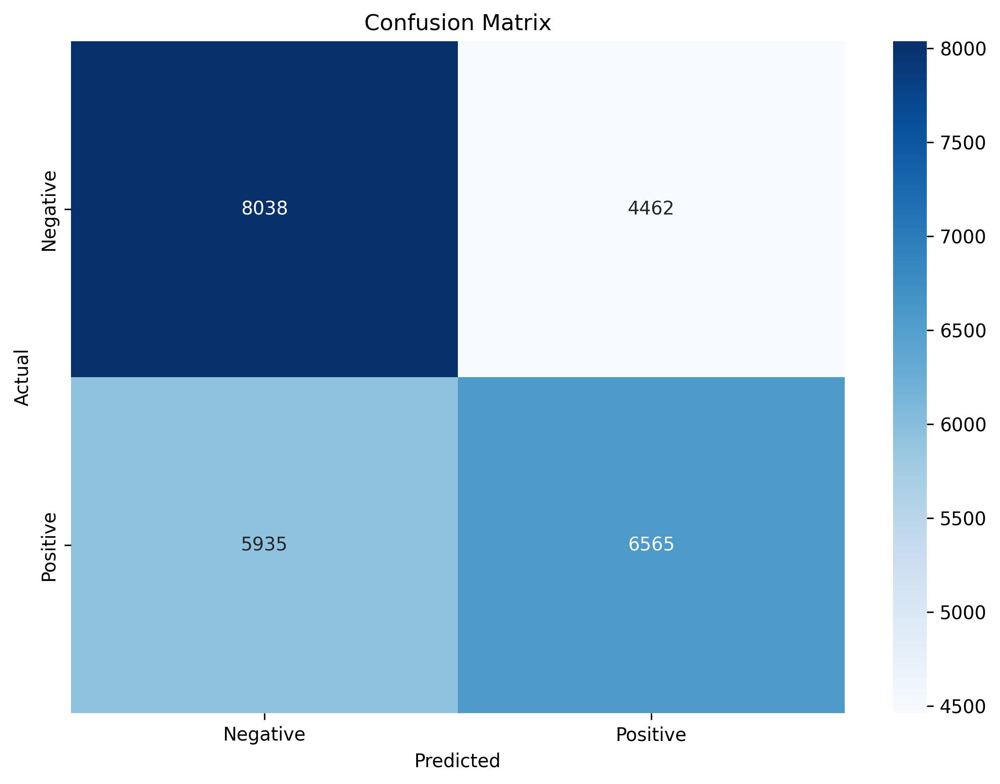
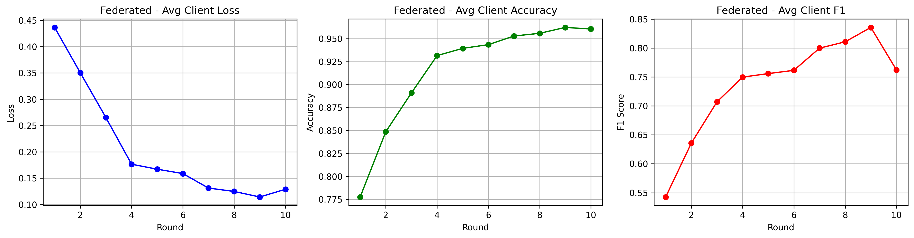
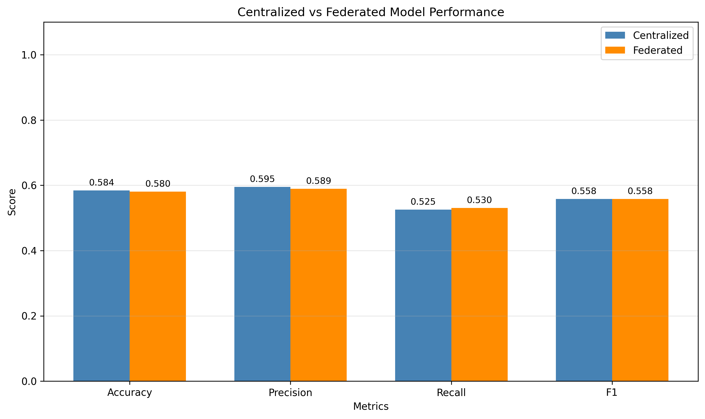

# IMDB Sentiment Classification with Federated Learning


A comprehensive NLP project implementing sentiment classification on IMDB movie reviews using both **Centralized Training** and **Federated Learning** approaches. This project demonstrates how to train machine learning models on sensitive data while maintaining data privacy through federated learning.

**中文文档**: [README_CN.md](README_CN.md)

## 📋 Table of Contents

- [Overview](#overview)
- [Features](#-features)
- [Project Structure](#-project-structure)
- [Getting Started](#-getting-started)
- [How to Run](#-how-to-run)
- [Results](#-results)
- [Visualization](#-visualization)
- [Configuration](#-configuration)
- [Technical Details](#-technical-details)
- [Future Improvements](#-future-improvements)

## 🎯 Overview

This project implements an end-to-end sentiment classification system for IMDB movie reviews:

1. **Centralized Training**: Traditional machine learning approach where all data is aggregated in one location
2. **Federated Learning (FedAvg)**: Privacy-preserving approach where models are trained across distributed clients without sharing raw data

### Key Technologies

- **PyTorch**: Deep learning framework
- **LSTM**: Bidirectional LSTM for sequence modeling
- **FedAvg**: Federated Averaging algorithm
- **HuggingFace Datasets**: IMDB dataset loading
- **NLTK**: Text preprocessing

## ✨ Features

### NLP Pipeline
- Text preprocessing (lowercasing, punctuation removal, stopword removal)
- Tokenization and vocabulary building
- Sequence padding and encoding
- Custom PyTorch Dataset and DataLoader

### Models
- **Baseline Model**: Embedding + Linear classifier
- **LSTM Classifier**: Bidirectional LSTM with dropout and fully connected layers

### Federated Learning
- Non-IID data distribution across clients (Dirichlet allocation)
- FedAvg algorithm implementation
- Configurable number of clients and local epochs
- Communication rounds tracking

### Evaluation
- Comprehensive metrics (Accuracy, Precision, Recall, F1)
- Confusion matrix visualization
- Training curves comparison

## 📁 Project Structure

```
IMDB/
├── README.md
├── README_CN.md
├── .gitignore
├── configs/
│   └── config.yaml               # Configuration file
├── src/
│   ├── models/                   # Neural network architectures
│   │   ├── __init__.py
│   │   └── sentiment_model.py   # LSTM and baseline models
│   ├── data/                     # Data loading and preprocessing
│   │   ├── __init__.py
│   │   ├── loader.py             # Dataset loading and splits
│   │   └── preprocess.py         # Text preprocessing and vocab
│   ├── training/                 # Training scripts
│   │   ├── __init__.py
│   │   ├── centralized.py        # Centralized training
│   │   └── federated.py          # Federated training
│   ├── federated/                # Federated learning components
│   │   ├── __init__.py
│   │   ├── server.py             # FL server and aggregation
│   │   └── client.py             # FL client logic
│   ├── evaluation/               # Evaluation and visualization
│   │   ├── __init__.py
│   │   └── evaluate.py           # Metrics and plotting
│   └── utils/                    # Utility functions
│       ├── __init__.py
│       └── utils.py              # Config, metrics, I/O helpers
├── docs/
│   └── images/                   # Documentation images
│       ├── centralized_confusion_matrix.png
│       ├── federated_confusion_matrix.png
│       ├── federated_training_curves.png
│       └── model_comparison.png
├── outputs/                      # Runtime artifacts (ignored by Git)
│   ├── models/                   # Saved model checkpoints
│   ├── logs/                     # Training logs and metrics
│   └── plots/                    # Generated visualizations
├── data/                         # Downloaded dataset cache (ignored)
├── requirements.txt
└── environment.yml
```

**GitHub Sync Notes:**
- Commit source code, configs, and documentation only
- Do not commit generated artifacts in `outputs/`, `data/`, or model checkpoints
- All runtime outputs are automatically ignored via `.gitignore`

## 🚀 Getting Started

### Prerequisites

- Python 3.10+
- Conda (recommended) or pip
- CUDA-capable GPU (optional, for faster training)

### Option A: Conda Environment (Recommended)

```bash
# Create environment from file
conda env create -f environment.yml

# Activate environment
conda activate fl_imdb
```

### Option B: Manual Installation

```bash
# Create new conda environment
conda create -n fl_imdb python=3.10
conda activate fl_imdb

# Install dependencies
pip install -r requirements.txt
```

### Download NLTK Data

The first time you run the project, NLTK will automatically download required resources:
- Stopwords
- Punkt tokenizer

## 📖 How to Run

### 1. Centralized Training

Train the model on the complete centralized dataset:

```bash
python src/training/centralized.py
```

**What it does:**
- Downloads IMDB dataset automatically
- Splits into train/validation/test sets
- Trains an LSTM model for sentiment classification
- Saves the best model to `outputs/models/centralized.pt`
- Logs metrics to `outputs/logs/centralized_metrics.json`

### 2. Federated Learning Training

Train the model using federated learning across 5 clients:

```bash
python src/training/federated.py
```

**What it does:**
- Downloads IMDB dataset automatically
- Distributes data to 5 clients with non-IID distributions
- Runs FedAvg for 10 communication rounds
- Each client trains locally for 2 epochs per round
- Saves the best global model to `outputs/models/federated.pt`
- Logs metrics to `outputs/logs/federated_metrics.json`

### 3. Evaluation

Evaluate both models and generate comparison visualizations:

```bash
python src/evaluation/evaluate.py
```

**What it generates:**
- Confusion matrices for both models
- Training curves
- Model comparison bar charts
- All plots saved to `outputs/plots/`

## 📊 Results

### Result Preview

#### Confusion Matrices

| Centralized | Federated |
|---|---|
|  |  |

#### Training and Comparison





### Expected Performance

| Model | Accuracy | Precision | Recall | F1 Score |
|-------|----------|-----------|--------|----------|
| Centralized | ~85-88% | ~85-88% | ~85-88% | ~85-88% |
| Federated | ~82-86% | ~82-86% | ~82-86% | ~82-86% |

*Note: Actual results may vary based on random seed and data splits.*

### Federated Learning Process

The federated learning process follows these steps:

1. **Initialization**: Server broadcasts global model to all clients
2. **Local Training**: Each client trains on their local data
3. **Weight Aggregation**: Server collects and averages client weights using FedAvg
4. **Repeat**: Steps 1-3 for multiple communication rounds

```
Round 1:  Client 0 [Acc: 0.72] → Client 1 [Acc: 0.68] → ... → Aggregated
Round 2:  Client 0 [Acc: 0.76] → Client 1 [Acc: 0.74] → ... → Aggregated
...
Round 10: Client 0 [Acc: 0.85] → Client 1 [Acc: 0.82] → ... → Aggregated
```

## 📈 Visualization

The evaluation script generates the following plots:

### 1. Confusion Matrix
Shows prediction distribution across true/predicted labels.

### 2. Training Curves
- **Centralized**: Epoch-based loss, accuracy, and F1 curves
- **Federated**: Round-based client metrics progression

### 3. Model Comparison
Bar chart comparing accuracy, precision, recall, and F1 between centralized and federated models.

## 🔧 Configuration

Edit `configs/config.yaml` to customize:

```yaml
# Data Configuration
data:
  max_vocab_size: 20000    # Vocabulary size
  max_seq_length: 256      # Maximum sequence length
  batch_size: 32           # Batch size

# Model Configuration
model:
  embedding_dim: 128       # Word embedding dimension
  hidden_dim: 256          # LSTM hidden dimension
  num_layers: 2            # Number of LSTM layers
  dropout: 0.5             # Dropout rate

# Centralized Training
centralized:
  learning_rate: 0.001
  epochs: 10
  early_stopping_patience: 3

# Federated Configuration
federated:
  num_clients: 5           # Number of clients
  local_epochs: 2          # Local training epochs
  global_rounds: 10        # Communication rounds
  alpha: 0.5               # Dirichlet distribution parameter
  learning_rate: 0.001
```

## 🔬 Technical Details

### FedAvg Algorithm

The Federated Averaging (FedAvg) algorithm:

```
1. Server initializes global model w₀
2. For each round t = 1, 2, ...:
   a. Server broadcasts wₜ₋₁ to all clients
   b. For each client k in parallel:
      - Receive global weights
      - Train locally for E epochs
      - Send updated weights wₖᵗ to server
   c. Server aggregates: wₜ = Σₖ (nₖ/n) × wₖᵗ
```

### Non-IID Data Distribution

We use Dirichlet distribution (alpha parameter) to simulate realistic non-IID data:

- Low alpha (0.1): Highly non-IID, each client has skewed class distribution
- High alpha (1.0+): More IID-like, balanced distributions

### Model Architecture

**LSTM Classifier:**
- Embedding layer (vocab_size × embedding_dim)
- Bidirectional LSTM (2 layers, hidden_dim=256)
- Fully connected layers with dropout
- Binary classification output (positive/negative sentiment)

## 🔮 Future Improvements

1. **Differential Privacy**: Add noise to gradients for enhanced privacy
2. **Secure Aggregation**: Use cryptographic techniques for secure weight aggregation
3. **Model Compression**: Implement quantization and pruning for efficient FL
4. **Additional Models**: Add Transformer-based models (BERT, DistilBERT)
5. **Communication Efficiency**: Implement gradient compression techniques
6. **Dynamic Client Selection**: Only select available/relevant clients each round

## 📝 License

This project is open source and available under the MIT License.

## 👨‍💻 Author

Built as a portfolio project demonstrating:
- Deep Learning (NLP)
- Federated Learning
- PyTorch
- Data Privacy in ML

---

For questions or feedback, please open an issue on GitHub.
