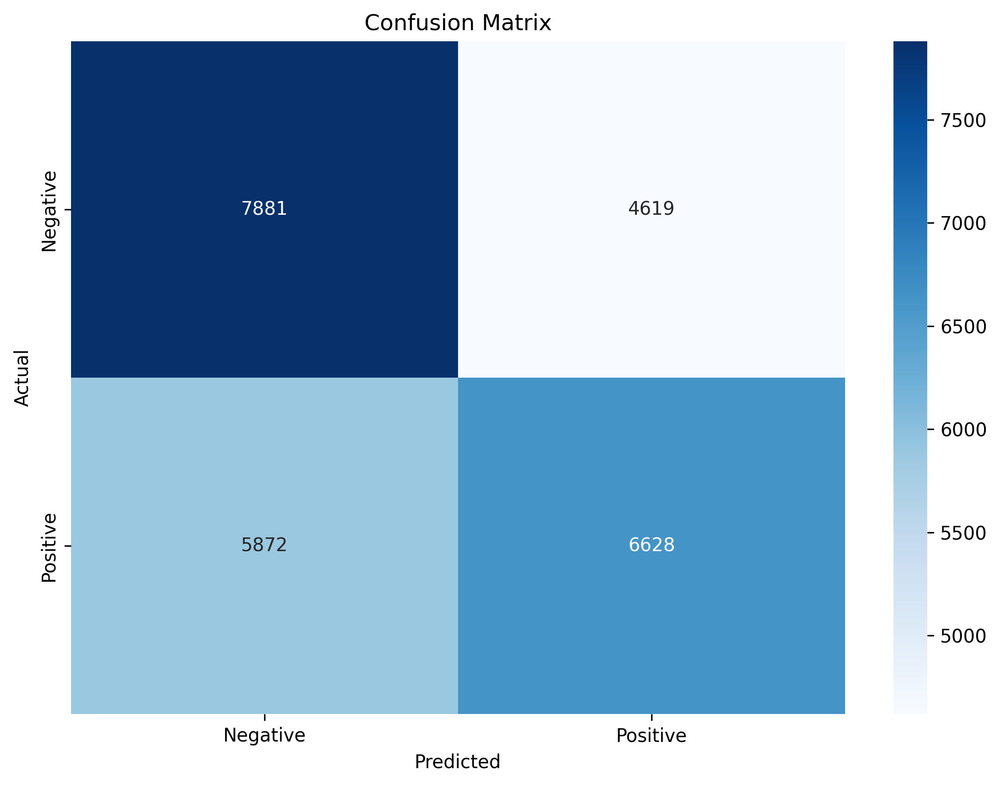

# IMDB Sentiment Classification with Federated Learning


End-to-end sentiment classification on IMDB movie reviews with two training paradigms:
- Centralized training baseline
- Federated learning with FedAvg

This repository is organized with one project workspace under project_root.

## Documentation

- English: [project_root/README.md](project_root/README.md)
- 中文: [project_root/README_CN.md](project_root/README_CN.md)

## Quick Start

```bash
cd project_root
conda activate fl_imdb

# 1) centralized baseline
python src/train_centralized.py

# 2) federated learning
python src/train_federated.py

# 3) evaluation + plots
python src/evaluate.py
```

## Result Preview

### Confusion Matrices

| Centralized | Federated |
|---|---|
|  |  |

### Training and Comparison


## Repository Layout

```text
IMDB/
├── README.md
├── .gitignore
├── outputs/                         # legacy local outputs (ignored)
└── project_root/
    ├── configs/
    ├── src/
    ├── outputs/                     # runtime artifacts (ignored)
    ├── data/                        # dataset cache (ignored)
    ├── requirements.txt
    ├── environment.yml
    ├── README.md
    └── README_CN.md
```

## GitHub Sync Notes

- Commit source code, configs, and docs.
- Do not commit generated artifacts in outputs or data.
- Always run scripts from project_root to avoid split output paths.
